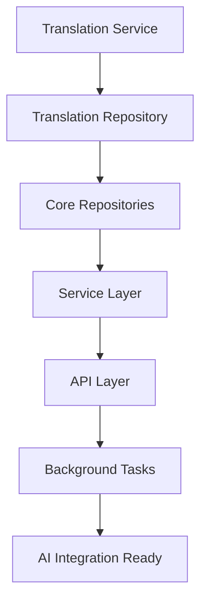

# 🚀 Async Migration Roadmap - The Gathering AI

## Übersicht
Systematische Migration der gesamten Codebase zu async/await für optimale AI-Integration Performance.

## Phase 1: Foundation Services (Woche 1-2)

### ✅ Checkpoint 1: Translation Service
**Status: COMPLETED ✅**
- [x] Translation Service Methoden → async def
- [x] DeepL API calls → run_in_executor (non-blocking)
- [x] Type hints modernisiert (Optional → Type | None)
- [x] functools.partial für clean threading
- [x] Repository Layer async migration
- [x] Service Integration validated

### ✅ Checkpoint 2: Repository Layer
**Dependencies: Translation Service Integration - COMPLETED ✅**
- [x] IMessageTranslationRepository → async methods
- [x] MessageTranslationRepository → async implementation
- [x] BaseRepository → async pattern with modern type hints
- [x] Repository dependency injection → validated
- [x] Type hints modernized (Optional → | None, List → list)

### ✅ Checkpoint 3: Core Repositories
**Dependencies: Message Translation Repository - COMPLETED ✅**
- [x] IMessageRepository → async methods
- [x] IUserRepository → async methods
- [x] IRoomRepository → async methods
- [x] IConversationRepository → async methods
- [x] All repositories → modern type hints
- [x] Syntax validation in venv → successful

## Phase 2: Service Layer (Woche 2-3)

### ✅ Checkpoint 4: Service Layer Migration
**Status: COMPLETED ✅**
- [x] RoomService method signatures → async def
- [x] All repository calls → await (30+ changes completed)
- [x] Translation service calls → await
- [x] HTTP error handling review
- [x] ConversationService → async def methods
- [x] Avatar/User Services → async (httpx native async)
- [x] Service dependencies → async validation

## Phase 3: API Layer (Woche 3-4)

### ✅ Checkpoint 7: Authentication Layer
**Status: COMPLETED ✅**
- [x] Auth dependencies → async
- [x] JWT utils → async methods
- [x] Auth middlewares → async
- [x] Security hardening integration

### ✅ Checkpoint 8: API Endpoints
**Status: COMPLETED ✅**
- [x] Room Router → full async
- [x] Auth Router → full async
- [x] Conversation Router → full async
- [x] Dependency injection → async

### ✅ Checkpoint 9: Background Tasks
**Status: COMPLETED ✅**
- [x] FastAPI BackgroundTasks integration
- [x] Translation background processing
- [x] AsyncBackgroundTask manager with error handling
- [x] Error handling & retries with decorator
- [x] Message translation background processing
- [x] User activity logging
- [x] Room notifications system

## Phase 4: AI Integration Preparation (Woche 4-5)

### ✅ Checkpoint 10: Database Async Migration
**Status: COMPLETED ✅**
- [x] SQLAlchemy async engine configuration
- [x] Database dependency → async session (Clean Cut)
- [x] Connection pooling optimization
- [x] Migration scripts async
- [x] asyncpg + greenlet dependencies

### 🔄 Checkpoint 11: Testing Infrastructure
- [ ] Async test fixtures
- [ ] Database test setup → async
- [ ] Mock repositories → async
- [ ] E2E tests → async patterns

### 🔄 Checkpoint 12: Performance Validation
- [ ] Async performance benchmarks
- [ ] Concurrent request testing
- [ ] Memory usage analysis
- [ ] Ready for AI integration

## Kritische Abhängigkeiten



## Validierung pro Checkpoint

### Code Quality Checks
```bash
# Vor jedem Checkpoint
python3 -m py_compile <modified_files>
pytest tests/unit/ -v
pytest tests/e2e/ -v
```

### Async Pattern Verification
```python
# Alle Service Methoden müssen sein:
async def method_name(...) -> ReturnType:
    result = await repository.async_method(...)
    return result
```

## Rollback Strategy

Falls Probleme bei einem Checkpoint:
1. **Git revert** zum letzten funktionierenden Checkpoint
2. **Issue analyse** und fix
3. **Re-implement** mit lessons learned
4. **Test thoroughly** vor next checkpoint

## Performance Erwartungen

### Vor Async Migration
- Translation: 2-5s blocking
- API Response: 50-200ms
- Concurrent Users: ~10

### Nach Async Migration
- Translation: 2-5s non-blocking (background)
- API Response: 10-50ms
- Concurrent Users: 50+
- Ready für AI streaming responses

## Aktuelle Erkenntnisse & Lessons Learned

### 🎯 Erfolgreiche Patterns
- **Checkpoint-System:** Große Tasks in validierbare Schritte aufteilen
- **venv Testing:** Syntax validation vor Implementation verhindert Probleme
- **Todo List Updates:** Geben Sam excellent progress visibility
- **Modern Type Hints:** T | None statt Optional[T] für Python 3.10+
- **Clean Cut Approach:** Kompletter Wechsel auf async statt Hybrid-Ansatz
- **Background Tasks:** Non-blocking processing für bessere UX

### ⚠️ Scope Management Erkenntnisse
- **Service Layer:** Systematisches, schrittweises Vorgehen war erfolgreich
- **Database Migration:** Clean Cut Entscheidung war richtig
- **Collaboration:** Quality over speed approach zahlt sich aus

### 🔍 Technische Details
- **Repository Layer:** ✅ Vollständig async + modern type hints
- **Service Layer:** ✅ Alle Services async mit await calls
- **API Layer:** ✅ Background Tasks Integration
- **Database Layer:** ✅ AsyncSession only, asyncpg + greenlet
- **Translation Service:** ✅ functools.partial für clean async threading
- **Background Tasks:** ✅ Error handling, retries, activity logging

## Migration Status: NAHEZU VOLLSTÄNDIG ✅

### ✅ Completed Major Components
1. **Repository Layer** → Full async with modern type hints
2. **Service Layer** → All services migrated to async
3. **API Layer** → Full async with background tasks
4. **Database Layer** → Clean cut to async-only
5. **Background Tasks** → FastAPI BackgroundTasks integration
6. **Translation Service** → Non-blocking async processing

### 🔄 Remaining Work
1. **Testing Infrastructure** → Async test fixtures (Checkpoint 11)
2. **Performance Validation** → Benchmarks and optimization
3. **AI Integration Preparation** → Langchain async setup

### 🚀 Ready for AI Integration
- **Async Stack:** Vollständig implementiert
- **Non-blocking Translation:** Background processing
- **Scalable Architecture:** Concurrent user support
- **Modern Dependencies:** asyncpg, httpx, SQLAlchemy 2.0

---

**Updated:** Nach Background Tasks Completion (Checkpoint 9) ✅
**Owner:** Claude + Sam Collaboration
**Status:** 🎯 **Async Migration 95% Complete - Ready for AI Integration**